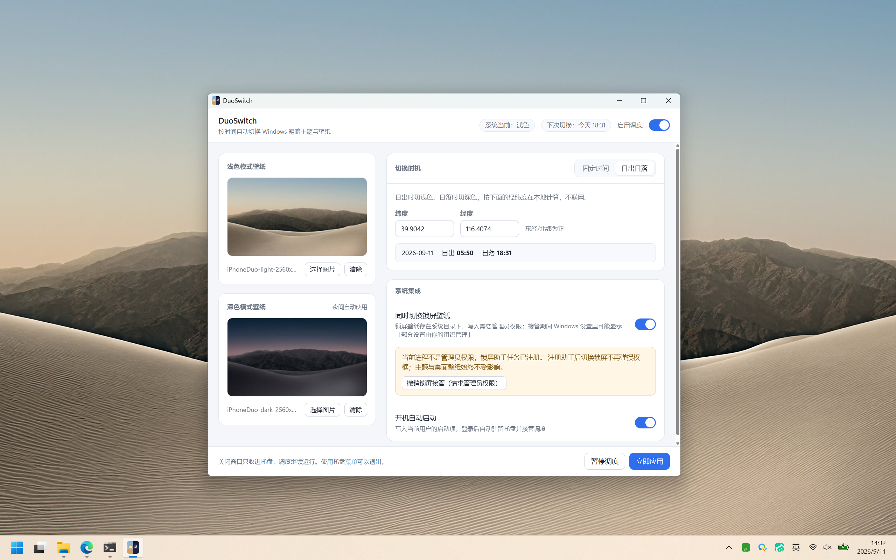
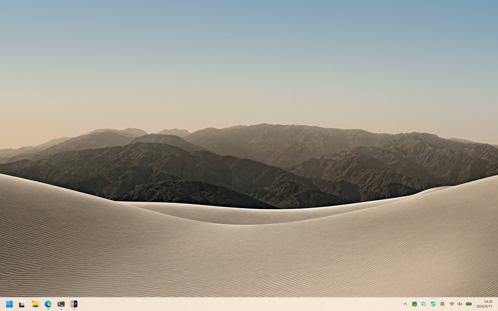
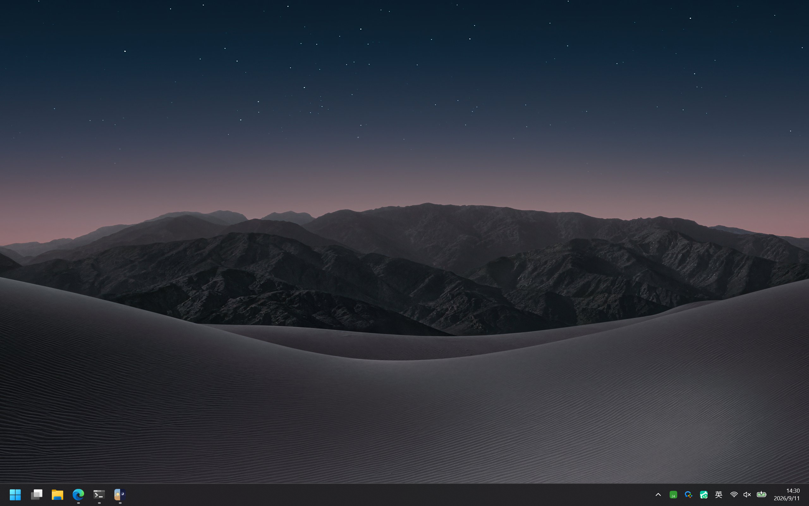

# DuoSwitch

按时间自动切换 Windows 明暗主题与壁纸的小工具。

装好就能用——内置了一对示例壁纸，要换成自己的图随时可改。

---

## 它能做什么

Windows 自带的「自动在浅色和深色间切换」**只改主题、不换壁纸**。
DuoSwitch 把这件事补上：按你设定的时间（或日出日落）一起切换主题和壁纸。

### 浅色模式壁纸

### 深色模式壁纸

---

## 主要功能

- **按时间自动切换**：固定时间点（每天 / 工作日 / 周末），或按本地经纬度的日出日落。
- **浅色 / 深色分别配壁纸**：每种模式各一张，互不干扰。
- **手动即时切换**：界面和托盘菜单都行，「立即应用」一键切到当前主题。
- **锁屏壁纸跟随**：可选开启，锁屏图也按主题切换。
- **托盘常驻**：关窗口不会退出，调度继续跑；用托盘菜单退出。
- **开机自启动**：登录后自动驻留托盘并接管调度。
- **首次启动有示例壁纸**：不用自己先找图就能体验完整流程。

---

## 怎么用

1. 在右侧「调度」里加时间点，或者选「日出日落」并填入你的经纬度。
2. 在左侧两张「浅色 / 深色模式壁纸」里选择图片，不满意随时换。
3. 关闭窗口即收进托盘；想彻底退出用托盘菜单里的「退出」。
4. 「暂停调度」会冻结自动切换，但手动切换和托盘菜单仍然可用。

调度窗口长这样：

---

## 锁屏壁纸的代价

锁屏图存在系统目录里，写入需要管理员权限。开启「同时切换锁屏壁纸」时：

- 会弹一次 UAC 授权。
- 接管期间 Windows 设置里可能显示「部分设置由你的组织管理」，这是微软
  给 MDM 的接口留下的提示，不是真的被管控。
- 关闭该开关后再点「撤销锁屏接管」会清掉注册表项，把锁屏交还系统。

不想折腾建议保持关闭——桌面壁纸已经能配合主题切换。

---

## 安装

从 [Releases](../../releases) 下载最新的 `DuoSwitch_0.1.0_x64-setup.exe`，
双击安装即可，不需要管理员权限。

- 安装位置：`%LOCALAPPDATA%\DuoSwitch\`
- 配置位置：`%APPDATA%\com.FinnXiong.duoswitch\config.json`
- 卸载：控制面板卸载 DuoSwitch，或直接删安装目录

---

## 内置壁纸的版权

仓库内置的示例壁纸是 **Apple iPhone Duo 主题壁纸**（沙丘 + 山峰），
版权归 **Apple Inc.** 所有，仅作为应用功能演示使用。
如需替换成自己的图，请直接在应用界面「浅色 / 深色模式壁纸」处点「选择图片」。

---

## 已知限制

- 仅 Windows 11 / 10。其他平台用不了。
- 切换壁纸是瞬间切换，不做淡入淡出。
- 多显示器按「填充」样式统一铺同一张图，不支持每屏不同。
- 锁屏接管依赖微软给 MDM 留的注册表项，系统更新可能改动这个接口，
  如有问题请关闭该功能。
